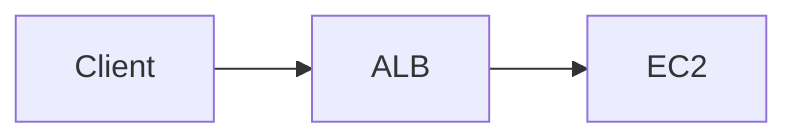

## Architecture Visualized

example 1:

example 2:


flowchart TB
    Partner[Premium Partner]
    
    subgraph "API Gateway (Throttling Layer)"
        CheckKey{Valid API Key?}
        CheckPlan{Usage Plan Check}
        Bucket[Token Bucket Algorithm]
    end
    
    Lambda["Weather Data Lambda"]
    
    Partner -->|Request + API Key| CheckKey
    CheckKey -->|Yes| CheckPlan
    CheckPlan -->|Within Rate/Quota| Bucket
    Bucket -->|Forward| Lambda
    CheckPlan -->|Exceeded| Error[429 Too Many Requests]
    


